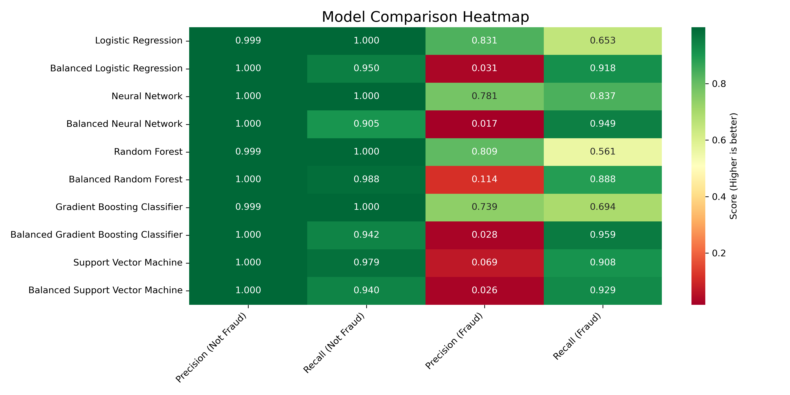

# Comparing ML-models for Fraud Detection in Credit Card Transactions

## Summary
In this project different ML-models are trained and their performance on detecting credit card fraud is compared to find the most suitable model for this. The project utilizes a highly unbalanced dataset with more than 280 000 credit card transactions where 492 have been identified as fraudulent to train the models
The project covered the following:
* Data pre processing (including undersampling)
* Training models: Logisitc Regression, Neural Network, Random Forrest, Gradient Boosting Model, Support Vector Machine
* Comparing model performance metrics

The conclusion is that the Neural Network model performed the best. The model successfully identifies a high proportion of fraudulent transactions (79.6%) while maintaining a low false positive rate (only 19.6% of its fraud predictions are incorrect).

## Code and resources used
**Python Version:** 3.11.5  
**Packages:** Pandas, Tensorflow, Seaborn, Matplotlib, Sklearn

## Data
The analysis has been conducted using a dataset containing data on 284807 credit card transactions made by European cardholders. The data was originally collected as part of a research collaboration between Worldline and the Machine Learning Group at Université Libre de Bruxelles.
It is available on Kaggle [here]([https://www.kaggle.com/datasets/mlg-ulb/creditcardfraud/data]).
The dataset includes 31 columns. Due to anonymity reasons, all columns except 'Time' and 'Amount' have been anonymized through PCA transformation.

## Data preprocessing
The data was divided into two series of datasets. One using all of the data and one using undersampling

## Implementing ML-Models
The following ML-models were trained using both the datset derived from all of the data and a balanced dataset derived from undersampling.
* Logisitc Regression
* Neural Network
* Random Forrest
* Gradient Boosting Model
* Support Vector Machine

## Comparing Model Performance
The performance metrics of the models are compared and visualized in the heatmap below. The models with names starting with "Balanced" have been trained on a balanced dataset derived from undersampling.

 

An effective fraud detection algorithm needs to balance two factors:
1. Minimizing false negatives (missed frauds), represented by high Recall (Fraud)
2. Minimizing false positives (legitimate transactions flagged as fraud), indicated by high Precision (Fraud)

Based on these criteria, the Non-balanced Neural Network model seems to be the best performer. It achieves a Precision (Fraud) of 0.804 and a Recall (Fraud) of 0.796. This model therefore successfully identifies a high proportion of fraudulent transactions (79.6%) while maintaining a low false positive rate (only 19.6% of its fraud predictions are incorrect). It also performs well in identifying non-fraudulent transactions, with perfect scores for both Precision and Recall (Not Fraud) meaning that it doesn't compromise the customer experience for legitimate transactions.

While balanced models show higher Recall (Fraud) in general, they suffer from extremely low Precision (Fraud), which would lead to an unacceptable number of false alarms.

**In conclusion, the Non-balanced Neural Network model should likely be selected. However, to validate this more information about the business implications of detecting fraudulent transactions against the cost of investigating false positives is needed.**
